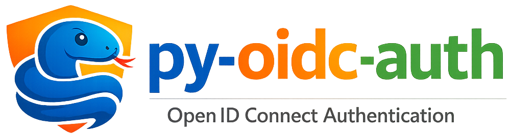

# py-oidc-auth

A small, typed OpenID Connect helper with:

* a framework independent async core: `OIDCAuth`
* framework adapters that expose common auth endpoints
* simple `required()` and `optional()` helpers to protect routes

The primary user experience is decorator style where the framework supports it.
For FastAPI, the same idea is expressed as dependencies.

<p align="center">
  
</p>

## Supported frameworks

* FastAPI
* Flask
* Quart
* Tornado
* Litestar
* Django

## Features

* Authorization code flow with PKCE (login and callback)
* Refresh token flow
* Device authorization flow
* Userinfo lookup
* Provider initiated logout (end session) when supported
* Bearer token validation using provider JWKS, issuer, and audience
* Optional scope checks and simple claim constraints
* Ships `py.typed`

## Install

Pick the extra for your framework:

```bash
pip install py-oidc-auth[fastapi]
pip install py-oidc-auth[flask]
pip install py-oidc-auth[quart]
pip install py-oidc-auth[tornado]
pip install py-oidc-auth[litestar]
pip install py-oidc-auth[django]
```

Import name is `py_oidc_auth`:

```python
from py_oidc_auth import OIDCAuth
```

## Concepts

### Core

`OIDCAuth` is the framework independent client. It loads provider metadata from the
OpenID Connect discovery document, performs provider calls, and validates tokens.

### Adapters

Each adapter subclasses `OIDCAuth` and adds:

* helpers to register the standard endpoints (router, blueprint, urlpatterns, etc.)
* `required()` and `optional()` helpers to validate bearer tokens on protected routes

## Default endpoints

Adapters can expose these paths (customizable and individually disableable):

* `GET  /auth/v2/login`
* `GET  /auth/v2/callback`
* `POST /auth/v2/token`
* `POST /auth/v2/device`
* `GET  /auth/v2/logout`
* `GET  /auth/v2/userinfo`

## Quick start

Create one auth instance at app startup:

```python
auth = ...(
    client_id="my client",
    client_secret="secret",
    discovery_url="https://idp.example.org/realms/demo/.well-known/openid-configuration",
    scopes="openid profile email",
)
```

### FastAPI

```python
from typing import Optional

from fastapi import FastAPI
from py_oidc_auth import FastApiOIDCAuth
from py_oidc_auth.schema import IDToken

app = FastAPI()

auth = FastApiOIDCAuth(
    client_id="my client",
    client_secret="secret",
    discovery_url="https://idp.example.org/realms/demo/.well-known/openid-configuration",
    scopes="openid profile email",
)

app.include_router(auth.create_auth_router(prefix="/api"))

@app.get("/me")
async def me(token: IDToken = auth.required()):
    return {"sub": token.sub}

@app.get("/feed")
async def feed(token: Optional[IDToken] = auth.optional()):
    return {"authenticated": token is not None}
```

### Flask

```python
from flask import Flask
from py_oidc_auth import FlaskOIDCAuth

app = Flask(__name__)

auth = FlaskOIDCAuth(
    client_id="my client",
    client_secret="secret",
    discovery_url="https://idp.example.org/realms/demo/.well-known/openid-configuration",
)

app.register_blueprint(auth.create_auth_blueprint(prefix="/api"))

@app.get("/protected")
@auth.required()
def protected(token):
    return {"sub": token.sub}
```

### Quart

```python
from quart import Quart
from py_oidc_auth import QuartOIDCAuth

app = Quart(__name__)

auth = QuartOIDCAuth(
    client_id="my client",
    client_secret="secret",
    discovery_url="https://idp.example.org/realms/demo/.well-known/openid-configuration",
)

app.register_blueprint(auth.create_auth_blueprint(prefix="/api"))

@app.get("/protected")
@auth.required()
async def protected(token):
    return {"sub": token.sub}
```

### Django

Decorator style:

```python
from django.http import JsonResponse
from django.urls import path
from py_oidc_auth import DjangoOIDCAuth

auth = DjangoOIDCAuth(
    client_id="my client",
    client_secret="secret",
    discovery_url="https://idp.example.org/realms/demo/.well-known/openid-configuration",
)

@auth.required()
async def protected_view(request, token):
    return JsonResponse({"sub": token.sub})

urlpatterns = [
    *auth.get_urlpatterns(prefix="api"),
    path("protected/", protected_view),
]
```

Routes only:

```python
urlpatterns = [
    *auth.get_urlpatterns(prefix="api"),
]
```

### Tornado

```python
import tornado.web
from py_oidc_auth import TornadoOIDCAuth

auth = TornadoOIDCAuth(
    client_id="my client",
    client_secret="secret",
    discovery_url="https://idp.example.org/realms/demo/.well-known/openid-configuration",
)

class ProtectedHandler(tornado.web.RequestHandler):
    @auth.required()
    async def get(self, token):
        self.write({"sub": token.sub})

def make_app():
    return tornado.web.Application(
        auth.get_handlers(prefix="/api") + [
            (r"/protected", ProtectedHandler),
        ]
    )
```

### Litestar

```python
from litestar import Litestar, get
from py_oidc_auth import LitestarOIDCAuth

auth = LitestarOIDCAuth(
    client_id="my client",
    client_secret="secret",
    discovery_url="https://idp.example.org/realms/demo/.well-known/openid-configuration",
)

@get("/protected")
@auth.required()
async def protected(token):
    return {"sub": token.sub}

app = Litestar(
    route_handlers=[
        protected,
        *auth.get_route_handlers(prefix="/api"),
    ]
)
```

## Scopes and claim constraints

All adapters support:

* `scopes="a b c"` to require scopes on a protected endpoint
* `claims={...}` to enforce simple claim constraints

Example:

```python
@auth.required(scopes="admin", claims={"groups": ["admins"]})
def admin(token):
    return {"sub": token.sub}
```

## Documentation

Docs are built with Sphinx using autodoc and RST pages.

Local build:

```bash
pip install -e .[docs]
cd docs
make html
```

If you build docs without installing all framework extras, use `autodoc_mock_imports` in `docs/conf.py`.
